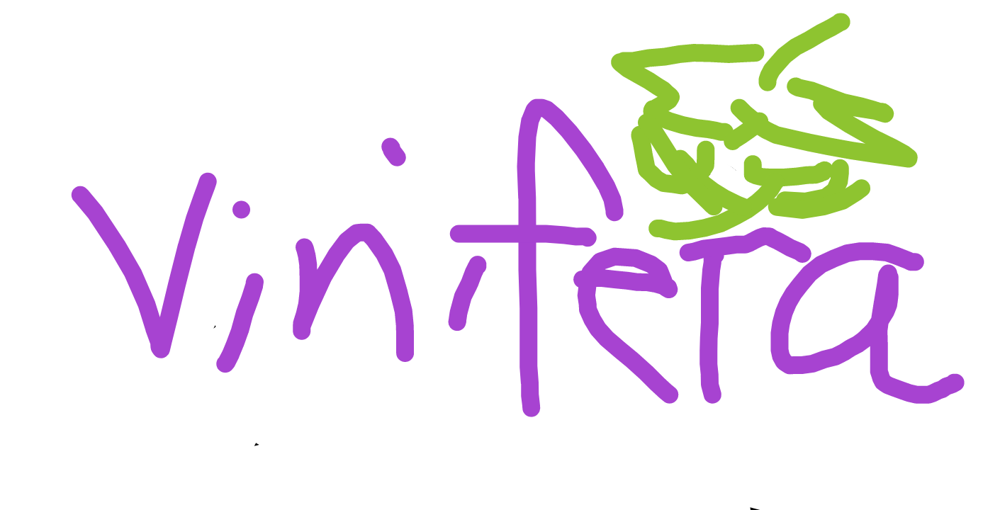
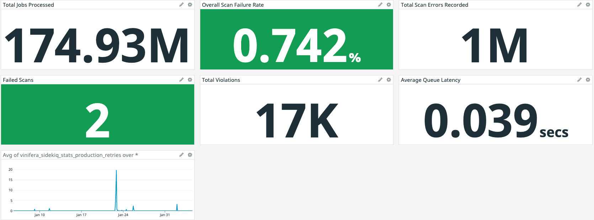
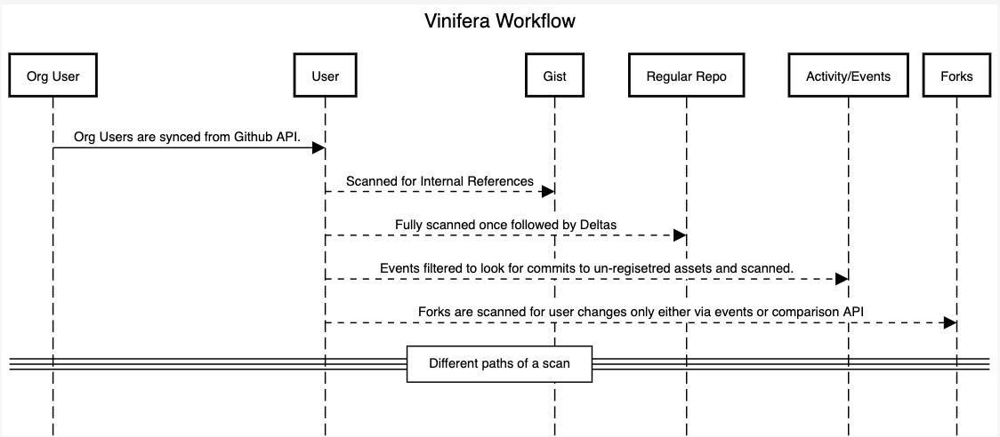

# Vinifera - Monitor Internal Leaks on Github 

#### Github Monitoring Tool :robot:



<hr> 

We have been using Vinifera in production since Dec 2019 and has helped us prevent security incidents.
Vinifera started out as an internal project to ensure Security hygiene of our public contributions and monitor potential leaks on Github.
We believe this will help other companies to strengthen their security hygiene when it comes to public sources like Github.



## What is Vinifera ?
Vinifera allows Companies/Organizations to monitor public assets to find references internal code leak and potential breaches.

Sometimes developers might leak internal code and credentials by accident. Vinifera aims to help companies detect those breaches in due time and respond to the incident.

## How does it work ? 

Vinifera monitors developers belonging to the organization, monitors and scan public contributions to look for potential voilations and breach of internal/secret/properitary code by looking for references defined.

* Vinifera works by syncing org users.
* For each user, all the public assets are registered (if not already tracked).
* Each asset (Repo, Gist) is then scanned for any differences.
* Each difference is then scanned, stored and reported (if contains anyleaks)



## What does the name mean?

During the development and inception of the tool, Security team consumed lots of grapes, so we named it after the fruit we love :)

Vinifera is inspired from the [Bionomial name of Grapes](https://en.wikipedia.org/wiki/Vitis_vinifera)

## Setup and Usage.

### Requirements
Vinifera requires installation of following tools:
1. Postgres
2. Redis
3. Docker 
4. Ruby (Install via rbenv/rvm )

### Setup 

#####  Github Access Token
To scan your organization members, Vinifera requires a token with ability to read Organization members.


Generate a new token (https://github.com/settings/tokens/new)[https://github.com/settings/tokens/new) with no special scope

You would want to use token of an admin user (with no special scope), since admin can list all users of an organization.

[https://docs.github.com/en/rest/reference/orgs#list-organization-members](https://docs.github.com/en/rest/reference/orgs#list-organization-members)

> If the authenticated user is also a member of this organization then both concealed and public members will be returned.


#### Docker
* Create `.docker_env` with needed variables

```bash
GITHUB_ACCESS_TOKEN=<REDACTED>
VINIFERA_ORG_NAME=<Your_org_name>

RAILS_MAX_THREADS=60 # This also controls DB pool

RAILS_MASTER_KEY=<REDACTED>


SLACK_UPDATES_GROUP_URL=https://hooks.slack.com/services/<YOUR_CONFIG_HERE>
SLACK_TARGETS_GROUP_URL=https://hooks.slack.com/services/<YOUR_CONFIG_HERE>
SLACK_USER_TRACKING_GROUP_URL=https://hooks.slack.com/services/<YOUR_CONFIG_HERE>
SLACK_VINIFERA_VIOLATION_GROUP_URL=https://hooks.slack.com/services/<YOUR_CONFIG_HERE>
SLACK_ERROR_GROUP_URL=https://hooks.slack.com/services/<YOUR_CONFIG_HERE>

# By default fork and big fork scanning is disabled
VINIFERA_ENABLE_FORK_SCANNING=false
VINIFERA_ENABLE_BIG_FORK_SCANNING=false
```

* Build 

```bash
docker-compose build 
```
* Run 

```bash
docker-compose up
```

<hr>
-  Re-building after any changes

```bash
docker-compose up --build
```
<hr>

#### Manual 

* Install required dependencies
```bash
cd <location_of_cloned_repo>
bundle install
```

* Setup DB and migrations
```bash
bundle exec rails db:create 
bundle exec rails db:migrate
```  

* Setup Environment Variables and Slack WebHook
Sample env file is available at `.example_env`
```bash
GITHUB_ACCESS_TOKEN=<REDACTED>
VINIFERA_ORG_NAME=<Your_org_name> # Name of org for which token was generated.

VINIFERA_DATABASE_HOST=<localhost>
VINIFERA_DATABASE_PASSWORD=<YOUR_PASSWORD>

RAILS_MAX_THREADS=60 # This also controls DB pool

RAILS_MASTER_KEY=<REDACTED>


SLACK_UPDATES_GROUP_URL=https://hooks.slack.com/services/<YOUR_CONFIG_HERE>
SLACK_TARGETS_GROUP_URL=https://hooks.slack.com/services/<YOUR_CONFIG_HERE>
SLACK_USER_TRACKING_GROUP_URL=https://hooks.slack.com/services/<YOUR_CONFIG_HERE>
SLACK_VINIFERA_VIOLATION_GROUP_URL=https://hooks.slack.com/services/<YOUR_CONFIG_HERE>
SLACK_ERROR_GROUP_URL=https://hooks.slack.com/services/<YOUR_CONFIG_HERE>


# Add this only if your are using Docker over TLS, recommended way, if on same host as vinifera, you may skip it

DOCKER_CLIENT_CERT_PATH=/home/deployer/.docker
DOCKER_HOST=tcp://<IP>:<PORT>

# By default fork and big fork scanning is disabled
VINIFERA_ENABLE_FORK_SCANNING=false
VINIFERA_ENABLE_BIG_FORK_SCANNING=false

REDIS_URL=redis://<REDIS_URI>
SIDEKIQ_REDIS_URL=redis://<REDIS_URI>
```

* Setup Cron Jobs
```bash
bundle exec whenever --update-crontab
```
* Setup your custom toml rules for Gitleaks. [For more info](https://github.com/zricethezav/gitleaks#rules-summary)
```toml
[[rules]]
# Insert your rules here
# description = "Internal References"
# regex = '''(?i)((.*)<COMPANY_INTERNAL_REFERENCES>(.*))'''
# tags = ["internal", "company","references"]
```  

* Start Sidekiq 
```bash
bundle exec sidekiq
```

##### Datadog

Additionally to get the metrics on Datadog like in the above screenshot, you can use DataDog agent - [https://docs.datadoghq.com/agent/](https://docs.datadoghq.com/agent/)

## Contributing 

We are open to contributions/bug fixes/performance improvements to our project :) 

## Donations

If you appreciate the tool we have built, feel free to contribute/donate to the projects on the top of which Vinifera was built :)

Vinifera is built on top of other open source software:
1. [Rails](https://github.com/rails/rails) (Our Favourite Web Framework)
2. [Sidekiq](https://github.com/mperham/sidekiq) (Handles Job LifeCycle, Scheduling and Retries)
3. [Gitleaks](https://github.com/zricethezav/gitleaks) (Gitleaks powers the code scanning via Docker Images)
4. [Docker](https://github.com/docker) (For running Scans in isolated environment)
5. [Docker-api](https://github.com/swipely/docker-api) (Ruby Client to interact with Docker Remote API)
6. [Sidekiq Throttled ](https://github.com/sensortower/sidekiq-throttled) (For Throttling workers)
7. [Octokit](https://github.com/octokit/octokit.rb) (Ruby Toolkit for Github API)
8. [Whenever](https://github.com/javan/whenever) (Cron Jobs in Ruby)

.... (list will go on ..., you get the gist ;) )

You can also donate to [Feeding India](https://www.feedingindia.org/)

## License 

Vinifera is licensed under the Apache License, Version 2.0. See [LICENSE](LICENSE) for the full license text.